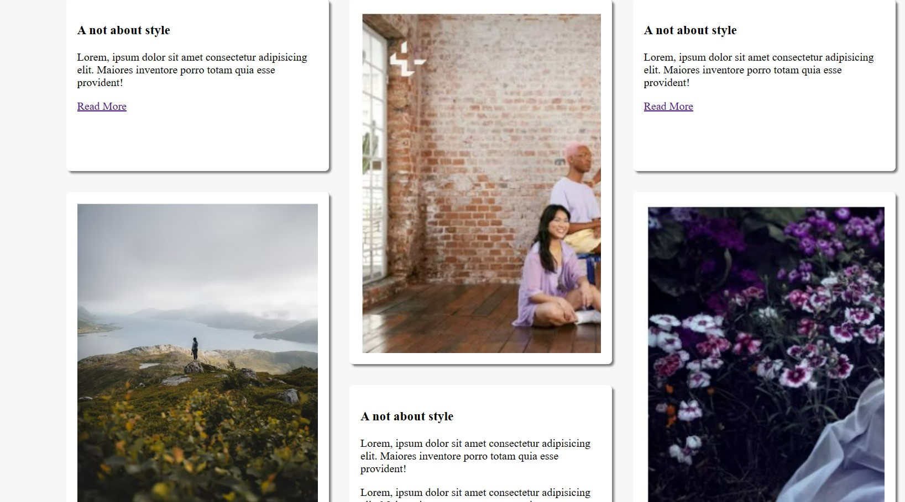

# MansoryStyle

 this project is build to show Mansory style using CSS Grid 
  and Html

nav bar divide by 5 with grid equal fraction
  # {display: grid;
 # grid-template-columns: repeat(5,1fr); }

i also use sydo class css on the nav bar to refer the middle upper
and bottom 
   # nav h1 div:first-child {
  # font-weight:800;
 # letter-spacing: 1.5px;
   # }
back ground shadow is implemented for good look for each div
# box-shadow: 3px 3px 3px rgba(0, 0, 0,0.5);

to create different height in row wise 
# main .short {
 # grid-row: span 1
# }

# main .tall {
 # grid-row: span 2;
# }

the final result look like
nav bar

main body

 @Copy Right # bisrat Mengesha 
 May 23 2024